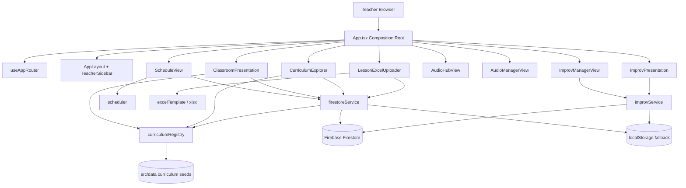
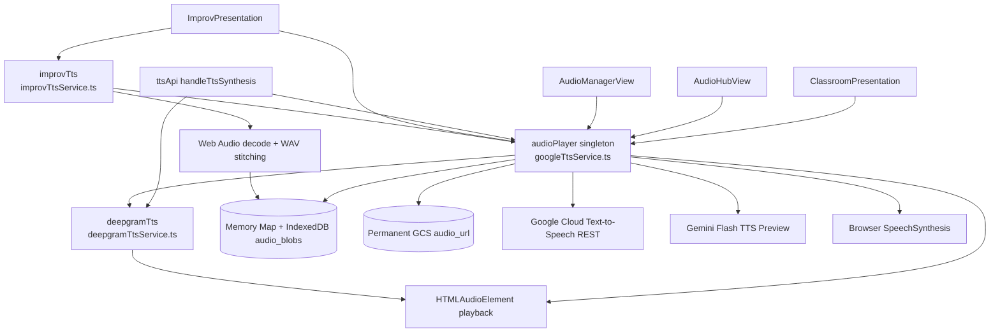

# Brain OS: CHUNKS Multi-Tier Classroom Platform & Knowledge Graph Governance (AGENTS.md)

You are operating within the **CHUNKS Teacher Classroom Platform** repository.
This repository governs a multi-tier, zero-bloat educational platform featuring live Google Cloud Firestore connectivity, in-browser Excel (.xlsx) ingestion, permanent GCS audio streaming, dynamic Deepgram Aura & Google Cloud TTS synthesis (Journey-F/M, Studio-O, Neural2-A), and wireless presenter remote clicker integration for English cohorts.

---

## 🏛️ 1. System Architecture & Repository Taxonomy

```text
chunks-class/
├── .github/workflows/              # Multi-tier CI/CD automation ($0/mo Always Free)
│   └── deploy-firebase.yml         # Typecheck, bundle build, and Firebase Hosting deployment
├── assets/                         # Public static assets & branding icons
├── src/
│   ├── api/                        # Modular API Endpoints (cohortsApi, lessonsApi, ttsApi)
│   ├── components/                 # UI Components (ClassroomPresentation, PartsDrawer, Sidebar, etc.)
│   ├── hooks/                      # Hardware Clicker (usePresenterClicker.ts) & Router (useAppRouter.ts)
│   ├── services/                   # Dynamic Registry, Firestore SDK, Deepgram & Google TTS
│   │   ├── curriculumRegistry.ts   # Dynamic In-Memory & Extensible Course Store
│   │   ├── firestoreService.ts     # Live Firestore Single-Doc Chunks Reader & Writer
│   │   ├── deepgramTtsService.ts   # Deepgram Aura Speech Engine
│   │   └── googleTtsService.ts     # Google Cloud TTS REST API Engine
│   ├── types/                      # Canonical Open Domain Models & TypeScript interfaces
│   └── utils/                      # Dynamic Recurrence Math & SheetJS Excel parser/generator
├── .firebaserc                     # Multi-site target mapping (chunks-classroom, default)
├── firebase.json                   # Granular cache-control (no-cache index.html, 1yr immutable assets)
└── firestore.rules                 # Production Firestore security rules
```

---

## 🤖 2. Multi-Agent Dispatching & Role Taxonomy

When executing tasks across this repository, agents MUST operate within their defined functional boundaries:

| Agent Role | Primary Jurisdiction | Responsibilities & Verification Gates |
| :--- | :--- | :--- |
| **Lead Architect & Orchestrator** | Root, `src/types/`, Lifecycle | Ensures system coherence, validates OpenSpec task matrices, enforces zero-slop contracts, and supervises cross-component handoffs. |
| **Frontend & UI/UX Engineer** | `src/components/`, `src/hooks/` | Builds high-contrast presentation stages, presenter clicker listeners, parts drawers, and responsive schedules. Enforces `Be Vietnam Pro` glyph safety. |
| **Data & Dynamic Specialist** | `src/services/`, `src/utils/` | Manages Firestore schemas, dynamic `CurriculumRegistry`, SheetJS Excel parser/builder, and safe chunked batch syncs. |
| **Cloud & Audio Systems Engineer** | `src/services/*tts*`, `.github/` | Maintains GCS audio streaming, Deepgram Aura & Google Cloud TTS API, and $0/mo free tier quotas. |
| **QA & Compliance Auditor** | Entire Codebase | Executes static typechecking (`tsc --noEmit`), verifies link graphs, ensures zero mockups in production mode, and audits frontmatter schemas. |

---

## 🧭 2.1 Codebase Graphify Research Map


Current graph entrypoints and ownership boundaries:

```text
App.tsx
├── useAppRouter.ts                         # URL route <-> NavTab mapping
├── AppLayout.tsx / TeacherSidebar.tsx       # Main shell and navigation
├── ScheduleView.tsx                         # Cohort calendar, session launch
├── ClassroomPresentation.tsx                # Lesson/chunk projector runtime
├── ImprovManagerView.tsx                    # Improv package authoring/runtime management
├── ImprovPresentation.tsx                   # Hint-based classroom projector runtime
├── CurriculumExplorer.tsx                   # Course/lesson browsing and sync surface
├── AudioHubView.tsx                         # Voice presets, API keys, day-level audio prep
├── AudioManagerView.tsx                     # Course-level audio readiness, batch prep, chunk audition/edit
├── SettingsView.tsx                         # Firestore sync and diagnostics
└── LessonExcelUploader.tsx                  # XLSX lesson ingestion

src/services/
├── firestoreService.ts                      # Firebase app, courses, lessons, cohorts, single-doc chunks, batch sync
├── curriculumRegistry.ts                    # In-memory course/lesson fallback and dynamic registry
├── googleTtsService.ts                      # Central audio facade: cache, playback, provider routing, Google/Gemini TTS
├── deepgramTtsService.ts                    # Deepgram Aura voice list, sanitizer, REST synthesis
├── improvService.ts                         # Improv CRUD, local fallback, XLSX/LLM generation helpers
├── improvTtsService.ts                      # Improv hint/item audio synthesis, Web Audio stitching, IndexedDB cache
├── firebase.ts                              # Firebase config export for shared consumers
└── speechService.ts                         # Local speech engine helper

src/types/
├── index.ts                                 # Course, lesson, chunk, cohort, audio, nav contracts
└── improv.ts                                # Improv package/session/item/hint contracts

src/utils/
├── scheduler.ts                             # Cohort recurrence and default cohort generation
└── excelTemplate.ts                         # XLSX template generation and GCS audio URL conventions
```

Primary data graph:

```text
Firestore collections
├── /courses/{courseId}                      # Dynamic course metadata
├── /lessons/{lessonId}                      # Single document per lesson; chunks live in doc.data().chunks[]
├── /cohorts/{cohortId}                      # Schedule, sessions, audio_settings
└── /improv_packages/{packageId}             # Improv sessions/items/hints

Fallback stores
├── curriculumRegistry                       # Seeded Level A, Level B EREL, Level B ERES
├── localStorage: chunks_firestore_synced_cohorts
├── localStorage: chunks_improv_packages_local
├── localStorage: chunks_active_audio_provider
├── localStorage: chunks_custom_tts_api_keys
├── localStorage: chunks_deepgram_api_key
└── IndexedDB: chunks_audio_db/audio_blobs   # Prepared TTS blobs keyed by voice::text and improv item/hint keys
```

Architectural invariants discovered from current code:

- `App.tsx` is the composition root and owns active cohort/session/projector state.
- `firestoreService.ts` is the only Firestore data gateway for courses, lessons, cohorts, and curriculum sync.
- Lesson chunks remain embedded in `LessonDoc.chunks`; no chunk subcollection is queried.
- `curriculumRegistry.ts` is the offline/default data plane for Level A, Level B EREL, and Level B ERES.
- `googleTtsService.ts` exports the singleton `audioPlayer`; UI components should route playback through it instead of constructing provider calls directly.
- `deepgramTtsService.ts` owns Deepgram Aura REST synthesis and text prosody sanitization.
- `improvTtsService.ts` adds an Improv-specific layer for hint language resolution, individual hint cache keys, and stitched continuous item audio.
- Presenter runtime safety depends on `activeSequenceId` / `activeSequenceRef` invalidation in audio and presentation flows.

---

## 🏗️ 2.2 Archify Visualization Of Current Project



Audio/TTS runtime graph:



---

## 📐 3. Dynamic Database & Domain Contracts

### 3.1 Fully Dynamic Course & Lesson Storage
- **No Hardcoded Level Lock-in**:
  - `CourseLevel` is an extensible type (`LEVEL_A`, `LEVEL_B`, `LEVEL_C`, `IELTS_DRILL`, `CUSTOM`).
  - Courses are dynamically loaded from Firestore collection `/courses/{courseId}` with `curriculumRegistry` fallback.
- **Single-Doc Chunks Array**:
  - All chunks of a lesson are stored in a contiguous array field `doc.data().chunks: ChunkItem[]`.
  - **Strict Prohibition**: Never query subcollections for chunks (preserves $0/mo Firestore free tier quotas).

### 3.2 Dynamic Cohort Auto-Scheduler Contract
- **Calculation Rule**: Given a `start_date`, `days_of_week`, and `total_sessions` (arbitrary N sessions), `calculateSessions` generates sequential calendar dates using timezone-safe local noon date arithmetic.
- **Status Preservation**: Modifying cohort schedules preserves existing `completed` and `in_progress` session statuses.

### 3.3 Multi-Provider Audio / TTS Architecture
- **Central Facade**: `googleTtsService.ts` exports the singleton `audioPlayer`, which owns provider selection, prepared audio cache, source listeners, loading listeners, playback cancellation, and Google/Gemini key-pool failover.
- **Text Sanitization**: `sanitizeSpeechText` is exported from `deepgramTtsService.ts` and re-exported by `googleTtsService.ts`; it converts `//`, `|`, semicolons, and slash-separated alternatives into speech-safe prosody.
- **Persistent Prepared Cache**:
  1. Memory `Map<string, string>` for instant current-session playback.
  2. IndexedDB database `chunks_audio_db`, store `audio_blobs`, for browser-persistent synthesized audio.
  3. Cache keys include direct text, sanitized text, and `voice::sanitizedText` composite keys; Improv uses `improv_hint_*` and `improv_item_*` keys.
- **English Runtime Priority**:
  1. Prepared cache (`audioPlayer.getCachedAudioAsync`).
  2. Deepgram Aura when provider is `DEEPGRAM_AURA` or voice starts with `aura-*`.
  3. Permanent GCS `chunk.audio_url` only when using the default/non-custom Google path and not forcing cloud TTS.
  4. Google Cloud Text-to-Speech for `en-US-*` voices.
  5. Gemini Flash TTS Preview when the active key type starts with `AQ.`.
  6. Browser Speech Synthesis fallback with `en-US`.
- **Vietnamese Runtime Priority**:
  1. Prepared cache with a `vi-*` voice.
  2. Google Cloud Text-to-Speech with `vi-VN-*` voices (`Neural2`, `WaveNet`, `Standard`, `Chirp3-HD`).
  3. Browser Speech Synthesis fallback with `vi-VN`.
  4. Deepgram and `en-US-*` voices must not be used for Vietnamese text.
- **Batch Preparation**: `prepareChunksAudio` runs a bounded worker pool (`1..8`) over lesson chunks and can target English, Vietnamese, or both; `AudioHubView` triggers day-level prep and `AudioManagerView` triggers lesson/course-level prep.
- **Improv Audio Layer**: `improvTtsService.ts` can synthesize single hints, combine all hints in an `ImprovItem` with Web Audio and ~1 second silence gaps, encode the result to WAV, and persist both hint and item audio to the shared IndexedDB-backed cache.
- **Race Condition Protection**: `activeSequenceId` in `audioPlayer` and `improvTts`, plus `activeSequenceRef` in `ImprovPresentation`, invalidate in-flight playback/timeouts upon clicker navigation, stop, or replay.
- **Diagnostic Surfaces**: `AudioDiagnosticModal`, `AudioHubView`, and `AudioManagerView` expose source status, provider switching, key testing, cache readiness, and audition flows.

### 3.4 Hardware Remote Clicker Mappings
- `PageDown` / `Space` / `ArrowRight`: Advance to next chunk & play audio.
- `PageUp` / `ArrowLeft`: Return to previous chunk.
- `Key R`: Replay active chunk audio.
- `Key B` / `Period`: Toggle pitch-black blackout overlay (`#000000`).
- `Key V`: Toggle Vietnamese subtitle visibility.
- `Key L`: Toggle Word & Chunks List drawer.
- `Key P`: Toggle Parts Navigation drawer.
- `Key F` / `F5`: Toggle Fullscreen mode.

---

## 🚀 4. CI/CD & Multi-Domain Hosting ($0.00 / Month Always Free)

### Automated Pipeline:
- **Trigger**: Every push to `main` / `master` or manual workflow dispatch.
- **Workflow**: `.github/workflows/deploy-firebase.yml`
- **Target Site**: `chunks-classroom` → Deploys directly to **`https://chunks-classroom.web.app`**.
- **Caching Discipline**:
  - `/index.html`: `no-cache, no-store, must-revalidate` (guarantees instant updates on new deploys).
  - `/assets/**`: `public, max-age=31536000, immutable` (1-year immutable cache for content-hashed bundles).

---

## ⚡ 5. Strict Zero-Slop & Quality Assurance Principles

1. **Zero Mockups in Production**: Always load live data from Firestore / dynamic registry.
2. **Vietnamese Typography Safety**: All components load and render `Be Vietnam Pro` (Latin Extended).
3. **$0.00 / Month Always-Free Discipline**:
   - Firestore: ≤ 50,000 reads, 20,000 writes/day.
   - Cloud TTS / Deepgram: Controlled caching and batch worker pool.
   - Firebase Hosting: ≤ 10 GB storage, 360 MB/day egress.
4. **Continuous Verification**: Prior to merge, execute `bun x tsc --noEmit` and `bun run build`.

---

## 🛡️ 6. Strict Multi-Agent Orchestration & Subagent Delegation (IMMUTABLE GUARDRAIL)

1. **Zero Monolithic Execution in Parent Context**:
   - The Lead Orchestrator (Parent Agent) is **STRICTLY PROHIBITED** from using write tools (`replace_file_content`, `write_to_file`) to implement features or write production code directly.
2. **Mandatory Subagent Dispatching (`invoke_subagent`)**:
   - ALL code generation, UI component development, service modifications, and bug fixes MUST be decomposed into clear domain tasks and dispatched to specialized subagents via `invoke_subagent`.
3. **Parent Lead Orchestrator Responsibilities**:
   - Understand requirements and compile architectural contracts & domain prompts for subagents.
   - Dispatch subagents and monitor their background execution.
   - Coordinate cross-component handoffs.
   - Execute QA verification gates (`bun x tsc --noEmit`, `bun run build`, and `git push`).
